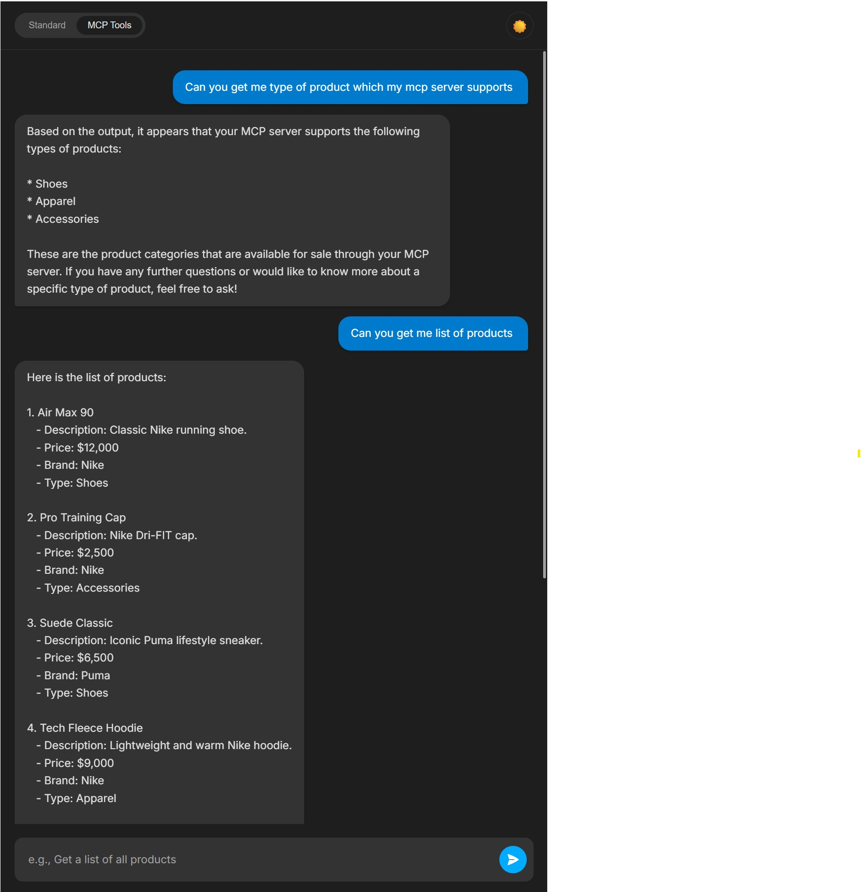
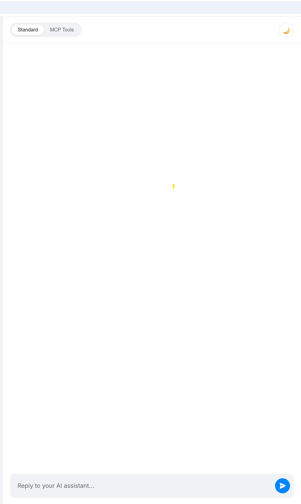

# AI Chat UI for MCP Backend

## Table of Contents

- [Description](#description)
- [Architecture](#architecture)
- [Key Features](#key-features)
- [Getting Started](#getting-started)
- [Configuration](#configuration)
- [Available Scripts](#available-scripts)
- [Screenshots](#screenshots)
- [Contact](#contact)

## Description

This project is a modern and responsive conversational chat interface built with React. It serves as the frontend for the ecommerce-mcp-client, allowing users to interact with a e-commerce backend using natural language.

Instead of traditional forms and buttons, this UI provides a chatbot experience where users can type commands like "show me all Nike products" or "add an item to my cart," and the AI-powered backend handles the rest.

## Architecture

This React application is the user-facing component of a larger, multi-service architecture. It communicates directly with the MCP Client Gateway, which orchestrates the interaction with the AI and backend services.

## Key Features

- **Conversational Chat Interface:** A clean and intuitive UI for chatbot-style interactions.
- **Dual Chat Modes:** Supports both a tool-enabled mode (for interacting with the e-commerce store) and a conversational memory mode.
- **Light/Dark Theme Switcher:** A toggle to switch between a sleek dark theme and a clean light theme.
- **Built with React:** A modern, component-based frontend for a high-performance user experience.
- **Backend Integration:** Pre-configured to connect to the ecommerce-mcp-client API.

## Getting Started

### Prerequisites

- Node.js v18 or higher
- npm v9 or higher
- A running instance of the Ecommerce MCP Client Gateway (which this UI connects to)

### Installation

Clone the repository:

```bash
git clone https://github.com/surajbadhe/mcp-client-ui.git
cd mcp-client-ui
```

Install dependencies:

```bash
npm install
```

### Running the App

To start the development server:

```bash
npm start
```

The application will open in your browser at [http://localhost:3000](http://localhost:3000).

## Configuration

The backend API endpoint is configured via an environment variable.

Create a file named `.env` in the root of the project and add the following line, pointing to your running MCP Client Gateway application:

```env
REACT_APP_API_URL=http://localhost:8090/api
```

Your chat components will then make calls to endpoints like `http://localhost:8090/api/chat`.

## Available Scripts

- `npm start` – Starts the development server.
- `npm run build` – Builds the application for production.
- `npm test` – Runs the test suite.

## Screenshots

**Chat interface in dark mode**



**Chat interface in light mode**



## Contact

Maintainer: [Suraj Badhe](https://github.com/surajbadhe)
